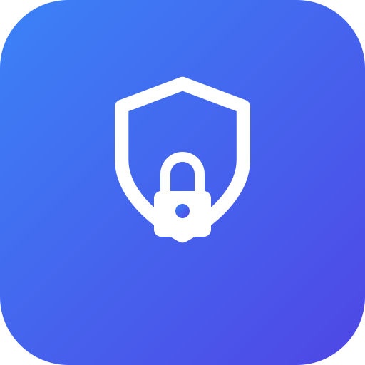

<p align="center">
  
</p>

<h1 align="center">Seal3D</h1>

<p align="center">
  <a href="https://github.com/valerius21/seal3d/actions/workflows/ci.yml"></a>
</p>

Client-side file encryption using AES-256-GCM and Web Crypto API. Files never leave your device.

## Features

- **Encrypt & decrypt files** entirely in the browser — nothing is uploaded to a server
- **AES-256-GCM** encryption via the Web Crypto API with PBKDF2 key derivation (100 000 iterations)
- **Streaming chunk processing** (5 MiB blocks) so large files don't exhaust memory
- **Authenticated chunk integrity** — per-file ID and block index as AAD prevent chunk-swapping and reordering attacks (inspired by gocryptfs)
- **Passphrase generator** — cryptographically random 6-word passphrases from the EFF wordlist (~77.5 bits of entropy)
- **Password visibility toggle** — show/hide the password field for easier entry
- **Drag-and-drop file selection** with click-to-browse fallback
- **Dark mode** — automatic light/dark theme support
- **Keyboard shortcut** — press Enter in the password field to start processing
- **PWA-ready** — SVG favicon and icons matching app branding

## Tech Stack

- Next.js 16 (App Router, Turbopack)
- React 19
- Tailwind CSS 4
- TypeScript 5.9
- OpenNext for Cloudflare Pages deployment

## Usage

```bash
bun install
bun dev
```

## Deployment

### Cloudflare Pages

Uses the OpenNext adapter for Cloudflare Pages.

```bash
bun run deploy
```

### Docker

A pre-built image is published to GHCR on every release:

```bash
docker pull ghcr.io/valerius21/seal3d:latest
docker run -p 3000:3000 ghcr.io/valerius21/seal3d:latest
```

Or build locally:

```bash
docker build -t seal3d .
docker run -p 3000:3000 seal3d
```

To use a custom hostname for metadata/SEO (default: `seal3d.app`):

```bash
docker build --build-arg APP_HOSTNAME=my-domain.com -t seal3d .
```

Then open http://localhost:3000.

## Citation

If you use Seal3D in your research, please cite it:

### BibTeX

```bibtex
@software{seal3d,
  author       = {Mattfeld, Valerius Albert Gongjus and Quentin, Lars},
  title        = {Seal3D},
  version      = {0.3.0},
  year         = {2026},
  url          = {https://github.com/valerius21/seal3d},
  note         = {Client-side file encryption using AES-256-GCM and Web Crypto API}
}
```

A [`CITATION.cff`](CITATION.cff) file is also provided for automated citation tools.

## License

Seal3D is released under the [MIT License](LICENSE).
